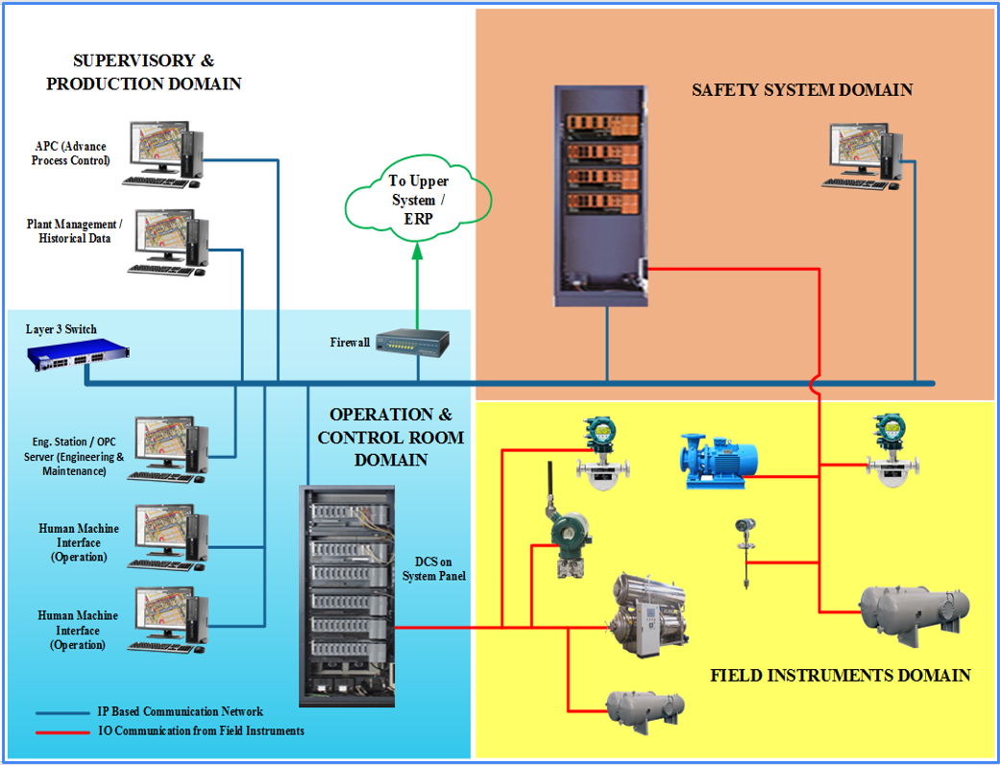
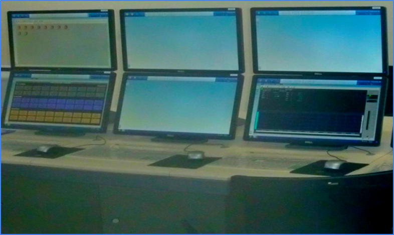

# SIS (Safety Instrumented System)

## Overview of Typical SIS Projects

Period of Service: October 2013 - August 2017

The project was to implement the Functional Safety Management (as per IEC 61511/61508) as well as process hazards analysis in the industry standards and emerging practices that apply to control systems, safety instrumented systems and automation system in general. The typical project work was to install the Yokogawa SIS (Prosafe-RS platform) as a standalone system or integrate it with the existing DCS.

## Role
### Safety Instrument Engineer
1. Facilitating the Project Manager, Functional Safety Manager as well as Principal Body of Safety Management System to ensure the implementation runs as per guideline.
2. Leading an engineering team that consists of DCS and SIS engineer, project engineer, technicians, drafter, and document control.
3. Collaborating with procurement staff, project quality control, sales, and administration.
4. Maintaining communication and project updates with customers and stakeholders

## Typical Works
1. HMI (Human Machine Intercafe) in the CCR (Central Control Room)
   
   
   
2. Programming / Logic Generation

   

3. Equipment Tuning Analysis Panel

   

4. Outdoor / Indoor System Panel Installation

   

## Project Experiences / Portfolios

